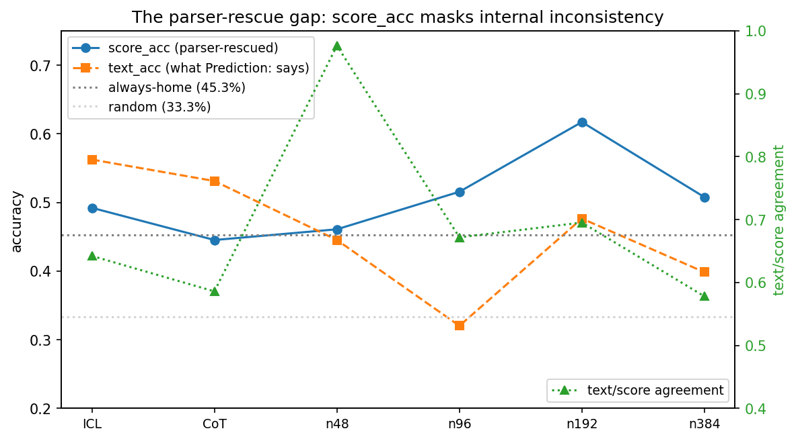

# football-llm-scaling

**QLoRA vs. ICL vs. CoT on a 192-example structured numerical reasoning task —
and a specific eval-convention failure mode the comparison uncovered.**

[](tests/)
[](pyproject.toml)
[](LICENSE)
[](paper/ECE590_Final_Project_Report.pdf)

> This repo extends [zanwenfu/football-llm](https://github.com/zanwenfu/football-llm)
> with a data-scaling ablation and an output-consistency analysis. The training
> data, adapter (`zanwenfu/football-llm-qlora`), and per-match statistics
> pipeline come from that base repo.

---

## The headline finding

On a FIFA World Cup match-prediction task (128 eval samples, 64 named + 64
anonymized), QLoRA fine-tuning appears to beat 5-shot ICL by 7 points:

|                                 | score_acc (legacy convention) | text_acc (what `Prediction:` says) | coherence_acc (text == score == GT) |
| ------------------------------- | ---------------------------: | ---------------------------------: | ----------------------------------: |
| always-home-win                 |                       45.3 % |                                  — |                                   — |
| ICL (5-shot, Llama-3.1-8B-Instr)|                       49.2 % |                             57.0 % |                              **42.2 %** |
| CoT (5-step, Llama-3.1-8B-Instr)|                       44.5 % |                             52.3 % |                              35.2 % |
| **QLoRA n=192** (same base)     |                   **61.7 %** |                             47.7 % |                              **42.2 %** |

That 61.7% headline number is the standard "score overrides text when both
parse" metric baked into `eval_harness.ipynb`. Under a *coherence-required*
metric that credits a prediction only when the `Prediction:` label, the
`Score:` line, and the ground truth all agree, the QLoRA advantage
**disappears**: ICL and QLoRA n=192 tie at 42.2%.

Looking at the raw outputs, on the in-distribution named split:

* When text and score disagree, **for QLoRA n≥96 the score matches GT 6–14× more
  often than the text label** — the parser silently converts misses into hits.
* For ICL and CoT the ratio reverses (text is the more reliable channel), so
  the same eval convention *penalizes* the prompting baselines.

Small-data fine-tuning in this regime learns output *format* with near-perfect
fidelity (100% compliance with the three-line template across all four
adapters) but does not bind fields into a coherent commitment. The paper
argues that benchmarks over structured multi-field generative outputs should
report coherence-required accuracy as a cheap diagnostic. Full write-up:
[**paper/ECE590_Final_Project_Report.pdf**](paper/ECE590_Final_Project_Report.pdf).



---

## Repo layout

```
src/                          flat module layout; imports are top-level
  config.py                   hyperparameters as frozen dataclasses
  parsing.py                  text_label / score_label / reasoning_label extractors (hardened)
  metrics.py                  three accuracy views, Wilson CIs, MAE, pred distribution
  consistency.py              A / B / C / C' / D regime taxonomy + disagreement directionality
  aggregate.py                multi-seed aggregation + bootstrap 95% CI
  structured.py               generalized taxonomy for any multi-field benchmark
                              (function calling, JSON output, tool use) — follow-up (c)
  data.py                     prediction I/O, named/anon split, stratified nested-prefix sampling
  prompts.py                  system prompts, ICL demo builder, CoT scaffold
  plotting.py                 every figure in the paper, reproducible from raw/
  generation.py               model loading + batch eval loop (lazy-imports torch)
  training.py                 QLoRA SFTTrainer wrapper (lazy-imports torch + trl)
  evaluation.py               end-to-end QLoRA / ICL / CoT orchestrator

scripts/                      thin CLI wrappers around the package
  01_train_scaling.py         train adapters at n ∈ {48, 96, 192} × multiple seeds
  02_run_evaluations.py       run an ICL / CoT / QLoRA eval → results/raw/
  03_analyze_results.py       results/raw/ → results/tables/ (auto-aggregates over seeds)
  04_make_figures.py          results/raw/ → results/figures/ (bootstrap bars if multi-seed)
  05_dump_contradictions.py   results/raw/ → results/examples/
  demo_structured_rescue.py   taxonomy applied to function-call + JSON benchmarks
  reproduce_paper.sh          one-shot driver

tests/                        78 unit tests; one per failure mode the paper fixed
notebooks/                    the original research notebooks, preserved verbatim
results/
  raw/                        per-sample prediction dumps (inputs to all analysis)
  tables/                     paper Tables 1–3, regime counts, disagreement directionality, aggregated_metrics
  figures/                    every figure in the paper + regime_stack
  examples/                   curated qualitative contradictions
paper/                        final project report (PDF) and original proposal (DOCX)
docs/                         METHODS, FIGURES, REPRODUCIBILITY
assets/                       course materials (lectures / homework / exams); not part of the package
```

A module is "analysis-only" if it can be imported without `torch` or any GPU
dependency. `generation.py` and `training.py` are the exceptions, and they
lazy-import their heavy deps inside the functions that need them. This
means analysis code can be read and run on a laptop.

---

## Quickstart

### Analysis-only (no GPU, no model download)

All tables and figures regenerate from `results/raw/*.json` in about one second:

```bash
pip install -e .                                    # matplotlib + numpy only
make all                                             # analyze + figures + contradictions
```

or directly:

```bash
python scripts/03_analyze_results.py --raw-dir results/raw --tables-dir results/tables
python scripts/04_make_figures.py --raw-dir results/raw --figures-dir results/figures
```

### Running the models (GPU required)

```bash
pip install -e '.[train]'                            # torch, transformers, peft, bnb, trl, ...

# Single-seed (matches the paper; Colab T4 takes ~6 min per 100 steps)
python scripts/01_train_scaling.py --budgets 48 96 192 --out adapters/

# Multi-seed sweep (addresses the paper's §5 seed-variance limitation)
python scripts/01_train_scaling.py --budgets 48 96 192 --seeds 42 43 44 --out adapters/

# Evaluate everything and save per-sample dumps
python scripts/02_run_evaluations.py --condition icl --out results/raw/icl_predictions.json
python scripts/02_run_evaluations.py --condition cot --out results/raw/cot_predictions.json
for n in 48 96 192; do
  python scripts/02_run_evaluations.py --condition qlora \
      --adapter adapters/n${n} \
      --out results/raw/scaling_predictions_n${n}.json
done
# n=384 uses the public adapter from the base repo:
python scripts/02_run_evaluations.py --condition qlora \
    --adapter zanwenfu/football-llm-qlora \
    --out results/raw/scaling_predictions_n384.json

make all                                             # tables + figures + examples
```

`bash scripts/reproduce_paper.sh --train --eval` does all of the above end-to-end.

#### Multi-seed output

When the training script is run with ``--seeds 42 43 44``, adapters land in
``adapters/n{budget}_s{seed}/``. Run `scripts/02_run_evaluations.py` once
per adapter, saving to ``results/raw/scaling_predictions_n{budget}_s{seed}.json``.
`scripts/03_analyze_results.py` auto-detects the `_s{seed}` suffix, groups
by budget, and writes an extra ``results/tables/aggregated_metrics.json``
with per-budget mean ± bootstrap 95% CI across seeds.
`scripts/04_make_figures.py` switches the scaling curve to error bars.

### Just the library

Import the package and work with your own raw dumps:

```python
from data import load_predictions
from metrics import compute_all_splits
from consistency import regime_counts, disagreement_directionality

records = load_predictions("results/raw/scaling_predictions_n192.json")

m = compute_all_splits(records)["overall"]
print(f"score_acc = {m.score_acc:.3f}   text_acc = {m.text_acc:.3f}   "
      f"coherence_acc = {m.coherence_acc:.3f}")
# score_acc = 0.617   text_acc = 0.477   coherence_acc = 0.422

rc = regime_counts(records)
print(f"A={rc.A}  B={rc.B}  C={rc.C} (parser-rescued)  "
      f"C'={rc.C_inv} (penalized)  D={rc.D}  U={rc.U}")

# Table 2 of the paper: on named samples only
named = [r for r in records if not r["is_anon"]]
d = disagreement_directionality(named)
print(f"rescue:penalty ratio = {d.parser_rescue_to_penalty_ratio:.1f}×")
```

### Applying the taxonomy to your own benchmark

The closing argument of the paper is that the parser-rescue phenomenon
likely surfaces on any benchmark that applies a "parse any reliable field"
convention to a multi-field generative output. The [`structured`](src/structured.py)
module lifts the taxonomy to an arbitrary set of fields and an arbitrary
label type, so you can drop it into function-calling, JSON-output, or
tool-use evaluations:

```python
from structured import FieldSpec, extract_function_argument, extract_function_name, \
                       structured_consistency_table

# Your two channels: function name and a specific argument
specs = [
    FieldSpec("name", extract_function_name),
    FieldSpec("city", lambda raw: extract_function_argument(raw, "city")),
]

pairs = [(record["raw_output"], record["gt_function_name"]) for record in my_eval]
table = structured_consistency_table(pairs, specs, primary="name")

print(f"primary_accuracy            = {table.primary_accuracy:.3f}")
print(f"coherence_required_accuracy = {table.coherence_required_accuracy:.3f}")
# A large gap between these two is the parser-rescue signature.
```

Run `python scripts/demo_structured_rescue.py` for worked examples on
(1) the paper's own football data via the generic machinery,
(2) an OpenAI-style function-call benchmark, and
(3) a three-field JSON intent benchmark.

---

## How the package maps to the paper

| Paper concept                                         | Module / function                                                              |
| ----------------------------------------------------- | ------------------------------------------------------------------------------ |
| The three output channels                             | [`parsing.extract_text_label`](src/parsing.py) / `extract_score_label` / `extract_reasoning_label` |
| "Score overrides text" legacy convention              | [`parsing.resolve_score_overrides_text`](src/parsing.py)  |
| Three accuracy views (Table 1)                        | [`metrics.compute_metrics`](src/metrics.py) → `score_acc`, `text_acc`, `coherence_acc` |
| Wilson 95% two-sided CIs                              | [`metrics.wilson_ci`](src/metrics.py), `wilson_halfwidth_pp` |
| Regime taxonomy A / B / C / C' / D                    | [`consistency.Regime`](src/consistency.py), `classify`, `regime_counts` |
| Disagreement directionality (Table 2)                 | [`consistency.disagreement_directionality`](src/consistency.py) |
| Stratified nested prefix (`s_48 ⊂ s_96 ⊂ s_192`)      | [`data.stratified_nested_prefix_indices`](src/data.py)    |
| Figure 1 (parser-rescue gap)                          | [`plotting.plot_consistency_curve`](src/plotting.py)      |
| Multi-seed mean ± bootstrap 95% CI (§5 follow-up)     | [`aggregate.aggregate_across_seeds`](src/aggregate.py)    |
| Generalized taxonomy for any multi-field benchmark    | [`structured.classify_multifield`](src/structured.py), `structured_consistency_table` |

Each module has a short header block explaining the paper section it came
from and the design decisions behind it.

---

## Design notes

**Analysis vs. training split.** The core of the paper is a parser + a set
of metrics over per-sample JSON dumps. We keep those completely free of GPU
dependencies: `matplotlib` and `numpy` are the only runtime needs for
`parsing`, `metrics`, `consistency`, `data`, `prompts`, and `plotting`. The
heavyweight imports (`torch`, `transformers`, `peft`, `bitsandbytes`, `trl`)
live in `generation.py` / `training.py` and are loaded lazily inside the
functions that need them. A reviewer with a laptop can regenerate every
table and every figure without touching a GPU.

**Hardened parser.** The original CoT evaluation silently mis-parsed squad-
goal totals like `303-167` as match scores because the bare-digit fallback
scanned the whole output. The current parser ([`parsing.extract_score`](src/parsing.py))
only applies the bare-digit fallback to the last 400 characters and requires
both sides to be in `[0, 15]`. This is covered by
[`tests/test_parsing.py::TestExtractScore::test_squad_goal_totals_are_not_mis_parsed`](tests/test_parsing.py).

**Coherence-required accuracy.** `metrics.ConditionMetrics.coherence_acc`
credits a prediction only when the `Prediction:` label, the `Score:` line,
and the ground truth all agree. It is trivial to compute, and the paper
argues that it should be reported alongside the primary accuracy number on
any structured multi-field generative benchmark.

**Regime taxonomy.** `consistency.Regime` classifies every sample into one of
A (coherent success), B (self-consistent mistake), C (parser-rescued),
C' (parser-penalized), D (fragmented), or U (unparseable). The regime
counts per condition are stored in `results/tables/regime_counts.json` and
are the data behind Table 2 of the paper.

**Nested stratified prefixes.** Accuracy changes across the scaling sweep
would be impossible to interpret if the n=48 sample were disjoint from the
n=192 sample. `data.stratified_nested_prefix_indices` guarantees
`s_48 ⊂ s_96 ⊂ s_192` while preserving the training-set class balance at
every budget, and verifies the subset invariant before returning.

---

## Reproducibility

* **Seed**: every source of randomness takes a seed argument; default is 42
  throughout.
* **Decoding**: `temperature=0.1`, `top_p=0.9`, `repetition_penalty=1.1`. CoT
  uses `max_new_tokens=1024`; QLoRA and ICL use 400. See
  [`config.GenerationConfig`](src/config.py).
* **Quantization**: 4-bit NF4 with double quantization, `float16` compute
  dtype.
* **LoRA**: rank 16, α=32, dropout 0.05, targeting the seven standard
  Llama-3.1 attention + MLP projections.
* **Training**: 3 epochs, effective batch 16 (1 × 16 grad-accum), LR
  2e-4 cosine with 10% warmup, weight decay 0.01.

Every training / evaluation run used `meta-llama/Llama-3.1-8B-Instruct` as
the base model on a single Colab T4.

---

## Related work

* **Base repo** — [zanwenfu/football-llm](https://github.com/zanwenfu/football-llm).
  Data-collection pipeline from API-Football, the `n=384` adapter
  (`zanwenfu/football-llm-qlora`) reused here, the served vLLM app, and the
  halftime-conditioned over/under baseline.
* **Paper references**, summarized in [paper/ECE590_Final_Project_Report.pdf](paper/ECE590_Final_Project_Report.pdf):
  Wei et al. 2022 (CoT); Brown et al. 2020 (ICL); Hu et al. 2022 (LoRA);
  Dettmers et al. 2023 (QLoRA); Kaplan et al. 2020 (scaling); Skalse et al.
  2022 and Krakovna et al. 2020 (specification gaming / reward hacking —
  the closest analogue to the parser-rescue phenomenon).

---

## Citing

```bibtex
@misc{fu2026parserrescue,
  author       = {Fu, Zanwen},
  title        = {The Parser-Rescue Gap: Why Small-Data Fine-Tuning
                  Inflates Accuracy on Structured Prediction},
  institution  = {Duke University},
  year         = {2026},
  howpublished = {\url{https://github.com/zanwenfu/football-llm-scaling}}
}
```

See [CITATION.cff](CITATION.cff) for a machine-readable version.

## License

MIT — see [LICENSE](LICENSE).
